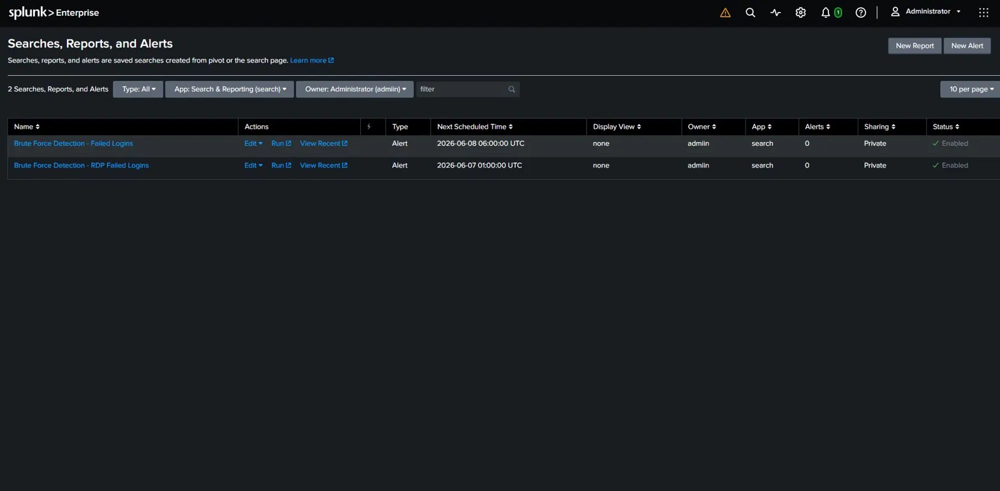

# SOC Detection Lab — Splunk SIEM Brute Force Detection

## Objective

The SOC Detection Lab project established a controlled three-machine 
environment to simulate and detect real cyber attacks using a 
self-hosted Splunk SIEM. The primary focus was configuring end-to-end 
log ingestion from a Windows 10 endpoint, simulating a live RDP brute 
force attack from Kali Linux, detecting it in real time using 
custom SPL queries, and documenting findings in a professional 
incident report.

## Skills Learned

- Hands-on Splunk SIEM configuration including log ingestion, 
  index management, and saved alert creation
- Windows Security Event Log analysis — Event ID 4625, 4624, 
  4720, 4726 and attack pattern recognition
- SPL (Search Processing Language) query writing for 
  brute force detection
- Real-world attack simulation using Hydra against RDP (port 3389)
- Incident documentation following SOC reporting standards
- MITRE ATT&CK framework mapping — T1110, T1021.001
- VMware virtual network configuration for isolated lab environments

## Tools Used

| Tool | Purpose |
|---|---|
| Splunk Enterprise 10.4 | SIEM — log ingestion, detection, alerting |
| Splunk Universal Forwarder | Windows log shipping agent |
| Splunk Add-on for Windows | Windows Event Log parsing |
| Hydra v9.6 | RDP brute force attack simulation |
| Kali Linux | Attacker machine |
| Windows 10 Education | Victim/log source machine |
| Ubuntu Server | Splunk SIEM server |
| VMware Workstation | Virtualization platform |

## Lab Environment

**Network:** VMware Workstation — NAT Network (192.168.135.0/24)

| Machine | OS | IP Address | Role |
|---|---|---|---|
| Splunk SIEM Server | Ubuntu Server | 192.168.135.128 | Log collection and analysis |
| Victim / Log Source | Windows 10 Education | 192.168.135.129 | Forwards Security Event Logs |
| Attacker Machine | Kali Linux | 192.168.135.130 | Simulates brute force attack |

**Attack flow:** Kali Linux → Hydra brute force → Windows 10 RDP (port 3389) → Events logged → Universal Forwarder → Splunk SIEM → Alert fires

## Steps

### Step 1 — Splunk Installation on Ubuntu Server

Installed Splunk Enterprise 10.4 on Ubuntu Server VM.
Configured receiving port 9997 for incoming log data.
Installed the Splunk Add-on for Microsoft Windows to enable
proper Windows Event Log parsing.

### Step 2 — Windows Universal Forwarder Configuration

Installed Splunk Universal Forwarder on Windows 10 VM.
Created outputs.conf pointing to Splunk server at
192.168.135.128:9997. Created inputs.conf to forward
Windows Security and System Event Logs.

### Step 3 — Log Ingestion Verified

Confirmed real-time Windows Security Event Logs flowing
into Splunk — 58 clean readable events including EventCode,
Account_Name, ComputerName, and Source_Network_Address fields.


### Step 4 — Brute Force Attack Simulation from Kali

Launched a live RDP brute force attack using Hydra from
Kali Linux (192.168.135.130) against the Windows 10 VM
administrator account on port 3389.


```bash
hydra -l administrator -P /usr/share/wordlists/rockyou.txt \
  rdp://192.168.135.129 -t 4 -W 3
```

### Step 5 — Real-Time Detection in Splunk

Detected the attack using this SPL query:

```splunk
index=main source="WinEventLog:Security" EventCode=4625
| stats count by Account_Name, Source_Network_Address
| sort -count
```

Result: 86 failed login attempts from 192.168.135.130
detected against the administrator account in under 3 minutes.


### Step 6 — Detection Alert Created

Saved the detection as a scheduled Splunk alert:
- Alert name: Brute Force Detection - RDP Failed Logins
- Trigger: more than 10 results from single source IP
- Schedule: runs every hour


### Step 7 — Incident Report Filed

Documented all findings in a professional SOC incident report
including attack timeline, MITRE ATT&CK mappings, response
actions taken, and security recommendations.

## MITRE ATT&CK Mapping

| Tactic | Technique ID | Technique Name |
|---|---|---|
| Credential Access | T1110 | Brute Force |
| Lateral Movement | T1021.001 | Remote Services: RDP |

## Detection SPL Query

```splunk
index=main source="WinEventLog:Security" EventCode=4625
| stats count by Account_Name, Source_Network_Address
| where count > 10
| sort -count
```

## Key Findings

- 86 failed RDP login attempts from single source IP in 3 minutes
- Attack tool identified as Hydra targeting administrator account
- No successful authentication occurred — attack contained
- Account lockout policy not configured — identified as security gap

## Recommendations

- Enable Windows account lockout policy after 5 failed attempts
- Restrict RDP access to known management IPs only
- Implement Multi-Factor Authentication on all remote access
- Monitor continuously for high volumes of Event ID 4625
